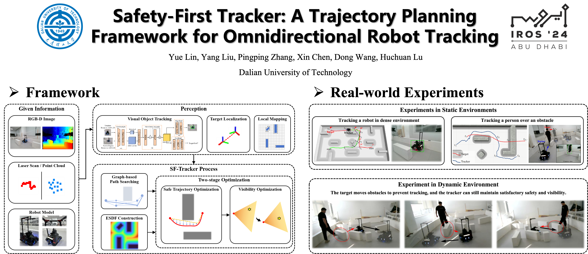

# SF-Tracker

## Paper

__Safety-First Tracker: A Trajectory Planning Framework for Omnidirectional Robot Tracking__. 
Accepted by __IROS 2024__.

Authors: [Yue Lin](https://github.com/Yue-0), Yang Liu, Pingping Zhang, [Xin Chen](https://github.com/chenxin-dlut), Dong Wang and Huchuan Lu.

## Video

[](https://m.youtube.com/watch?v=UtvWkrEPId4 "Video")

## Quick Start

This project needs to run under Ubuntu20.04 & ROS-noetic.

```shell
git clone https://github.com/Yue-0/SF-Tracker.git
cd SF-Tracker && catkin_make
source devel/setup.bash 
```

Run the simulation:

```shell
roslaunch simulator tracking.launch
```

Use `2D Pose Estimate` to publish the target's position.

You can change the value of `gui` in line 7 of [sim.launch](src/simulator/launch/sim.launch) to `true` to display Gazobo.

## Acknowledgements

We use [LBFGS-Lite](https://github.com/ZJU-FAST-Lab/LBFGS-Lite) to solve numerical optimization problems.
