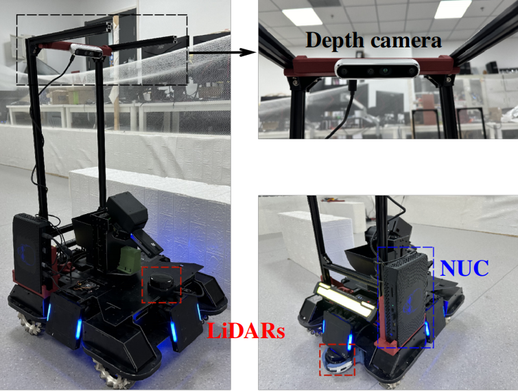

# Using SF-Tracker on Real-world Robot

__English__ | [简体中文](README_cn.md)

## Real-world Robot

Our algorithm supports ground omnidirectional robots, and the robot we use is the RoboMaster 2020 standard version AI robot, as shown in the figure below. We use an Intel NUC Phantom Canyon as the computing device, two single-line lidars for omnidirectional sensing, and an Intel Real-Sense D455 depth camera as the vision sensor.



## Install Requirements

### 1. Robot Driver

See [RoboRTS-Base](https://github.com/RoboMaster/RoboRTS-Base) to install the robot driver.

You can also modify line 3 of [detection.launch](launch/detection.launch) and line 3 of [tracking.launch](launch/tracking.launch) to support your own bots. Your robot should subscribe to topic `/cmd_vel` as velocity control volume, with message type `geometry_msgs/Twist`.

### 2. Lidar Driver

See [rplidar_ros](https://github.com/Slamtec/rplidar_ros) to install the lidar driver.

If using multiple radars, you also need to install `ira_laser_tools`:

```shell
git clone https://github.com/iralabdisco/ira_laser_tools
cd ..
catkin_make
cd src/real_world
```

You can also modify [lidar.launch](launch/lidar.launch) to support your own lidars.

### 3. Vision Algorithm Requirements

We use Python to implement the visual recognition algorithm and need to install Python requirements:

```
pip install -r requirements.txt
```

## Start Tracking any target

```shell
roslaunch real_world tracking.launch
```
