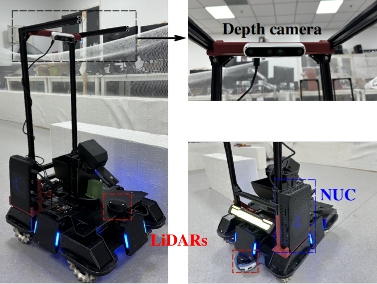

# 在真实机器人系统上使用 SF-Tracker

[English](README.md) | __简体中文__

## 真实机器人系统

我们的算法支持地面全向机器人，我们使用的机器人为 RoboMaster 2020 标准版 AI 机器人，如下图所示。我们使用 Intel NUC 幻影峡谷作为计算设备，两个单线激光雷达用于全向感知，一个 Intel Real-Sense D455 深度相机作为视觉传感器。



## 安装依赖

### 1. 机器人驱动

参见 [RoboRTS-Base](https://github.com/RoboMaster/RoboRTS-Base) 安装机器人驱动。

你也可以修改 detection.launch 的第 3 行或 tracking.launch 的第 3 行来支持自己的机器人。你的机器人应该订阅话题 `\cmd_vel` 作为速度控制量，消息类型为 `geometry_msgs/Twist`。

### 2. 雷达驱动

参见 [rplidar_ros](https://github.com/Slamtec/rplidar_ros) 安装雷达驱动。

如果使用多个雷达，你还需要安装 `ira_laser_tools`：

```shell
git clone https://github.com/iralabdisco/ira_laser_tools
cd ..
catkin_make
cd src/real_world
```

你也可以修改 [lidar.launch](launch/lidar.launch) 来支持你自己的雷达。

### 3. 视觉算法依赖

我们使用 Python 实现视觉识别算法，需要安装 Python 依赖：

```
pip install -r requirements.txt
```

你还需要下载目标检测或单目标跟踪模型的 ONNX 文件，参考[这里](onnx/README_cn.md)。

## 开始跟踪

跟踪行人：

```shell
roslaunch real_world detection.launch
```

跟踪任意目标：

```shell
roslaunch real_world tracking.launch
```
